# Class Diagram - AI File Management System

## Mermaid Diagram

```mermaid
classDiagram
    %% Core Application Classes
    class FastAPIApp {
        +app: FastAPI
        +lifespan()
        +root()
        +health_check()
        +websocket_endpoint()
    }

    class WebSocketManager {
        -connections: Dict[str, WebSocket]
        +connect(websocket, session_id)
        +disconnect(websocket, session_id)
        +send_personal_message(message, websocket)
        +broadcast_scan_progress(session_id, data)
        +broadcast_cleanup_status(cleanup_id, data)
    }

    %% Database Models
    class File {
        +id: UUID
        +path: str
        +name: str
        +size: int
        +file_type: str
        +category: str
        +hash_md5: str
        +hash_sha256: str
        +perceptual_hash: str
        +content_hash: str
        +confidence_score: float
        +is_duplicate: str
        +scan_session_id: UUID
        +created_at: datetime
        +modified_at: datetime
        +scanned_at: datetime
        +to_dict()
    }

    class Duplicate {
        +id: UUID
        +file_id: UUID
        +duplicate_file_id: UUID
        +duplicate_group_id: UUID
        +similarity_score: float
        +detection_method: str
        +is_primary: str
        +created_at: datetime
        +to_dict()
    }

    class ScanSession {
        +id: UUID
        +directory_path: str
        +status: str
        +files_processed: int
        +files_total: int
        +duplicates_found: int
        +errors_count: int
        +progress_percentage: float
        +started_at: datetime
        +completed_at: datetime
        +error_message: str
        +update_progress(files_processed, files_total, duplicates_found)
        +mark_completed()
        +mark_failed(error_message)
        +to_dict()
    }

    %% Service Classes
    class ScannerService {
        +classifier: SimpleClassifier
        +duplicate_detector: DuplicateDetector
        +supported_extensions: set
        +scan_directory(session_id, directory_path, db)
        +_get_files_recursive(directory_path)
        +_is_supported_file(file_path)
        +_process_file(file_path, session_id, db)
        +_calculate_hash(file_path, algorithm)
        +_detect_all_duplicates(processed_files, db)
        +_update_session_status(session_id, status, db)
        +_update_session_progress(session_id, files_processed, files_total, duplicates_found, progress, db)
    }

    class DuplicateService {
        +similarity_threshold: float
        +get_duplicate_groups(db, session_id, limit, offset)
        +get_duplicate_stats(db, session_id)
        +detect_duplicates_for_file(file_id, db)
        +_create_duplicate_group(group_id, duplicates, db)
        +_find_hash_duplicates(file, db)
        +_find_perceptual_duplicates(file, db)
        +_find_content_duplicates(file, db)
        +_file_to_info(file)
    }

    class CleanupService {
        +trash_dir: str
        +archive_dir: str
        +execute_cleanup(cleanup_id, request, db)
        +_delete_duplicates(rule, db)
        +_move_to_trash(rule, db)
        +_archive_old_files(rule, db)
        +_organize_by_type(rule, db)
        +_delete_file(file_id, db)
        +_ensure_directories()
    }

    %% ML Model Classes
    class SimpleClassifier {
        +categories: dict
        +classify_file(file_path)
        +get_file_info(file_path)
        +_classify_by_mime_type(mime_type)
    }

    class DuplicateDetector {
        +find_duplicates(file_paths)
        +_calculate_file_hash(file_path)
        +_compare_files(file1, file2)
    }

    %% API Routes (Unified)
    class APIRoutes {
        +scanner_service: ScannerService
        +duplicate_service: DuplicateService
        +cleanup_service: CleanupService
        +start_scan(request, background_tasks, db)
        +get_scan_status(session_id, db)
        +get_scan_sessions(limit, offset, db)
        +get_duplicates(session_id, limit, offset, db)
        +get_duplicate_stats(session_id, db)
        +execute_cleanup(request, background_tasks, db)
        +get_cleanup_status(cleanup_id)
        +get_scan_history(db)
        +get_scan_by_id(scan_id, db)
    }

    %% Frontend Components
    class App {
        +theme: Theme
        +Navigation()
        +Routes()
    }

    class Dashboard {
        +scanHistory: array
        +loading: boolean
        +error: string
        +loadScanHistory()
        +handleScanSelect(scanId)
    }

    class NewScanPage {
        +directoryPath: string
        +scanning: boolean
        +handleScanStart()
        +handleDirectorySelect()
    }

    class ScanDetailPage {
        +scanId: string
        +scanData: object
        +duplicates: array
        +stats: object
        +loadScanDetails()
    }

    class ScanHistoryPanel {
        +scanHistory: array
        +onScanSelect: function
        +onRefresh: function
        +loading: boolean
        +render()
    }

    class DuplicatePanel {
        +duplicates: array
        +onRefresh: function
        +render()
    }

    class CleanupPanel {
        +onCleanup: function
        +duplicates: array
        +loading: boolean
        +render()
    }

    class StatsPanel {
        +stats: object
        +render()
    }

    class UMLDiagrams {
        +value: number
        +loading: boolean
        +error: string
        +exportAnchorEl: HTMLElement
        +isExporting: boolean
        +diagrams: array
        +renderDiagrams()
        +handleExportAs(format)
        +handleExportClick()
    }

    %% Utility Classes
    class ApiService {
        +baseURL: string
        +healthCheck()
        +startScan(directoryPath)
        +getScanStatus(sessionId)
        +getDuplicates(sessionId, limit, offset)
        +getDuplicateStats(sessionId)
        +executeCleanup(cleanupRules)
        +getScanHistory()
        +getScanById(scanId)
    }

    class WebSocketHook {
        +socket: WebSocket
        +isConnected: boolean
        +connect(url)
        +disconnect()
        +sendMessage(message)
    }

    class ExportUtils {
        +exportAsImage(element, options)
        +exportAsPDF(element, options)
        +getDiagramTitle(diagrams, index)
        +sanitizeFilename(filename)
    }

    %% Relationships
    FastAPIApp --> WebSocketManager
    FastAPIApp --> APIRoutes

    APIRoutes --> ScannerService
    APIRoutes --> DuplicateService
    APIRoutes --> CleanupService

    ScannerService --> File
    ScannerService --> ScanSession
    ScannerService --> SimpleClassifier
    ScannerService --> DuplicateDetector

    DuplicateService --> File
    DuplicateService --> Duplicate

    CleanupService --> File
    CleanupService --> Duplicate

    SimpleClassifier --> File
    DuplicateDetector --> File

    App --> Dashboard
    App --> NewScanPage
    App --> ScanDetailPage
    App --> UMLDiagrams

    Dashboard --> ScanHistoryPanel
    ScanDetailPage --> DuplicatePanel
    ScanDetailPage --> CleanupPanel
    ScanDetailPage --> StatsPanel

    NewScanPage --> ApiService
    ScanDetailPage --> ApiService
    Dashboard --> ApiService

    NewScanPage --> WebSocketHook
    ScanDetailPage --> WebSocketHook

    UMLDiagrams --> ExportUtils

    %% Database Relationships
    File --> ScanSession
    Duplicate --> File
```



## ASCII Art Diagram

```
┌─────────────────────────────────────────────────────────────────┐
│                    AI File Management System                    │
│                         Class Diagram                          │
└─────────────────────────────────────────────────────────────────┘

┌─────────────────┐    ┌─────────────────┐    ┌─────────────────┐
│   FastAPIApp    │    │ WebSocketManager│    │     File        │
│─────────────────│    │─────────────────│    │─────────────────│
│ +app: FastAPI   │    │ -connections    │    │ +id: str        │
│ +lifespan()     │    │ +connect()      │    │ +name: str      │
│ +root()         │    │ +disconnect()   │    │ +path: str      │
│ +health_check() │    │ +send_message() │    │ +size: int      │
│ +websocket()    │    │ +broadcast()    │    │ +file_type: str │
└─────────────────┘    └─────────────────┘    │ +category: str  │
         │                       │             │ +hash_md5: str  │
         │                       │             └─────────────────┘
         │                       │                      │
         ▼                       ▼                      ▼
┌─────────────────┐    ┌─────────────────┐    ┌─────────────────┐
│  ScanController │    │DuplicateService │    │  DuplicateGroup │
│─────────────────│    │─────────────────│    │─────────────────│
│ +start_scan()   │    │ +detect_dups()  │    │ +id: str        │
│ +get_status()   │    │ +get_groups()   │    │ +primary_file_id│
│ +get_sessions() │    │ +get_stats()    │    │ +similarity: flt│
│ +cancel_scan()  │    │ +cleanup()      │    │ +space_wasted: i│
└─────────────────┘    └─────────────────┘    └─────────────────┘
         │                       │                      │
         │                       │                      │
         ▼                       ▼                      ▼
┌─────────────────┐    ┌─────────────────┐    ┌─────────────────┐
│   FileService   │    │  MLModelService │    │  ScanSession    │
│─────────────────│    │─────────────────│    │─────────────────│
│ +scan_dir()     │    │ +text_classifier│    │ +id: str        │
│ +get_file_info()│    │ +image_classifier│   │ +directory: str │
│ +calc_hash()    │    │ +ocr_processor  │    │ +status: str    │
│ +classify()     │    │ +classify_text()│    │ +progress: flt  │
└─────────────────┘    └─────────────────┘    └─────────────────┘
         │                       │                      │
         │                       │                      │
         ▼                       ▼                      ▼
┌─────────────────┐    ┌─────────────────┐    ┌─────────────────┐
│ TextClassifier  │    │ImageClassifier  │    │  OCRProcessor   │
│─────────────────│    │─────────────────│    │─────────────────│
│ +model: DistilBERT│  │ +model: CNN     │    │ +model: EasyOCR │
│ +tokenizer      │    │ +preprocess()   │    │ +extract_text() │
│ +classify()     │    │ +classify()     │    │ +preprocess()   │
│ +predict()      │    │ +predict()      │    │ +process()      │
└─────────────────┘    └─────────────────┘    └─────────────────┘

┌─────────────────────────────────────────────────────────────────┐
│                        Frontend Layer                          │
└─────────────────────────────────────────────────────────────────┘

┌─────────────────┐    ┌─────────────────┐    ┌─────────────────┐
│    ReactApp     │    │   ScanPanel     │    │ DuplicatePanel  │
│─────────────────│    │─────────────────│    │─────────────────│
│ +state: AppState│    │ +onScanStart    │    │ +duplicates[]   │
│ +useEffect()    │    │ +scanStatus     │    │ +onRefresh      │
│ +handleScan()   │    │ +loading: bool  │    │ +render()       │
│ +handleCleanup()│    │ +render()       │    │ +getFileIcon()  │
└─────────────────┘    └─────────────────┘    └─────────────────┘
         │                       │                      │
         │                       │                      │
         ▼                       ▼                      ▼
┌─────────────────┐    ┌─────────────────┐    ┌─────────────────┐
│  CleanupPanel   │    │   StatsPanel    │    │   ApiService    │
│─────────────────│    │─────────────────│    │─────────────────│
│ +onCleanup      │    │ +stats: Stats   │    │ +baseUrl: str   │
│ +duplicates[]   │    │ +render()       │    │ +startScan()    │
│ +loading: bool  │    │ +formatBytes()  │    │ +getStatus()    │
│ +render()       │    │ +getFileIcon()  │    │ +getDuplicates()│
└─────────────────┘    └─────────────────┘    └─────────────────┘
         │                       │                      │
         │                       │                      │
         ▼                       ▼                      ▼
┌─────────────────┐    ┌─────────────────┐    ┌─────────────────┐
│ WebSocketHook   │    │   Database      │    │      Redis      │
│─────────────────│    │─────────────────│    │─────────────────│
│ +socket: WS     │    │ +tables: File   │    │ +cache: dict    │
│ +isConnected    │    │ +tables: Group  │    │ +sessions: dict │
│ +connect()      │    │ +tables: Session│    │ +get()          │
│ +disconnect()   │    │ +query()        │    │ +set()          │
│ +sendMessage()  │    │ +insert()       │    │ +delete()       │
└─────────────────┘    └─────────────────┘    └─────────────────┘

Relationships:
- FastAPIApp → Controllers (Composition)
- Controllers → Services (Dependency)
- Services → Models (Aggregation)
- ReactApp → Components (Composition)
- Components → Services (Dependency)
- MLService → Classifiers (Composition)
```

## Draw.io Instructions

### Step 1: Create Main Classes
1. Open Draw.io (https://app.diagrams.net/)
2. Create rectangles for each main class:
   - FastAPIApp
   - WebSocketManager
   - File, DuplicateGroup, ScanSession
   - FileService, DuplicateService, MLModelService
   - TextClassifier, ImageClassifier, OCRProcessor
   - ScanController, DuplicateController, CleanupController
   - ReactApp, ScanPanel, DuplicatePanel, CleanupPanel, StatsPanel
   - ApiService, WebSocketHook

### Step 2: Add Attributes and Methods
For each class, add:
- **Attributes** (with data types)
- **Methods** (with parameters and return types)
- Use `+` for public, `-` for private, `#` for protected

### Step 3: Add Relationships
- **Composition** (filled diamond): FastAPIApp → Controllers
- **Aggregation** (hollow diamond): Services → Models
- **Inheritance** (hollow triangle): Not applicable here
- **Association** (simple line): ReactApp → Components
- **Dependency** (dashed line): Components → Services

### Step 4: Group Related Classes
- **Backend Layer**: FastAPIApp, Controllers, Services, Models
- **ML Layer**: MLModelService, TextClassifier, ImageClassifier, OCRProcessor
- **Frontend Layer**: ReactApp, Components, ApiService, WebSocketHook
- **Data Layer**: File, DuplicateGroup, ScanSession

### Step 5: Add Notes and Annotations
- Add notes explaining complex relationships
- Use stereotypes like `<<interface>>` for service classes
- Add cardinality (1:1, 1:*, *:*) on association lines
