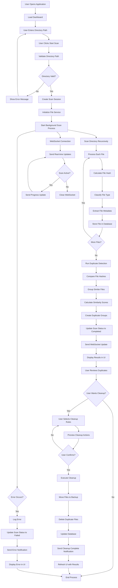

# Activity Diagram - AI File Management System

## Mermaid Diagram



## ASCII Art Diagram

```
┌─────────────────────────────────────────────────────────────────┐
│                    AI File Management System                    │
│                       Activity Diagram                         │
└─────────────────────────────────────────────────────────────────┘

    [User Opens App] 
           │
           ▼
    [Load Dashboard]
           │
           ▼
    [Enter Directory Path]
           │
           ▼
    [Click Start Scan]
           │
           ▼
    [Validate Directory] ──No──→ [Show Error] ──┐
           │ Yes                                │
           ▼                                    │
    [Create Scan Session]                       │
           │                                    │
           ▼                                    │
    [Start Background Process]                  │
           │                                    │
           ▼                                    │
    [Scan Directory Recursively]                │
           │                                    │
           ▼                                    │
    ┌─────────────────────────────────────────┐  │
    │         Process Each File               │  │
    │  ┌─────────────────────────────────┐   │  │
    │  │  Calculate Hash                 │   │  │
    │  └─────────────────────────────────┘   │  │
    │  ┌─────────────────────────────────┐   │  │
    │  │  Classify File Type             │   │  │
    │  └─────────────────────────────────┘   │  │
    │  ┌─────────────────────────────────┐   │  │
    │  │  Extract Metadata               │   │  │
    │  └─────────────────────────────────┘   │  │
    │  ┌─────────────────────────────────┐   │  │
    │  │  Store in Database              │   │  │
    │  └─────────────────────────────────┘   │  │
    └─────────────────────────────────────────┘  │
           │                                    │
           ▼                                    │
    [More Files?] ──Yes──→ [Process Next] ────┘
           │ No
           ▼
    [Run Duplicate Detection]
           │
           ▼
    [Compare File Hashes]
           │
           ▼
    [Group Similar Files]
           │
           ▼
    [Calculate Similarity Scores]
           │
           ▼
    [Create Duplicate Groups]
           │
           ▼
    [Update Status: Completed]
           │
           ▼
    [Send WebSocket Update]
           │
           ▼
    [Display Results in UI]
           │
           ▼
    [User Reviews Duplicates]
           │
           ▼
    [User Wants Cleanup?] ──No──→ [End Process]
           │ Yes
           ▼
    [User Selects Cleanup Rules]
           │
           ▼
    [Preview Cleanup Actions]
           │
           ▼
    [User Confirms?] ──No──→ [Select Rules]
           │ Yes
           ▼
    [Execute Cleanup]
           │
           ▼
    [Move Files to Backup]
           │
           ▼
    [Delete Duplicate Files]
           │
           ▼
    [Update Database]
           │
           ▼
    [Send Cleanup Complete]
           │
           ▼
    [Refresh UI with Results]
           │
           ▼
    [End Process]

┌─────────────────────────────────────────────────────────────────┐
│                    Parallel Processes                          │
└─────────────────────────────────────────────────────────────────┘

    [WebSocket Connection] ──→ [Send Real-time Updates]
           │                           │
           ▼                           ▼
    [Scan Active?] ──Yes──→ [Send Progress Update] ──┐
           │ No                                        │
           ▼                                          │
    [Close WebSocket]                                  │
                                                      │
    [Error Occurs?] ──Yes──→ [Log Error] ────────────┘
           │ No
           ▼
    [Continue Processing]
```

## Draw.io Instructions

### Step 1: Create Main Flow
1. Open Draw.io
2. Use **Activity Diagram** template
3. Create the main flow from "User Opens Application" to "End Process"
4. Use **Start** and **End** nodes (circles)
5. Use **Activity** nodes (rounded rectangles) for actions
6. Use **Decision** nodes (diamonds) for conditions

### Step 2: Add Decision Points
Create decision diamonds for:
- Directory Valid?
- More Files?
- User Wants Cleanup?
- User Confirms?
- Scan Active?
- Error Occurs?

### Step 3: Add Parallel Processes
- Create a **Fork** node after "Start Background Scan Process"
- Add parallel branch for WebSocket updates
- Use **Join** node before "End Process"

### Step 4: Add Error Handling
- Create error handling branch from main process
- Include error logging and notification steps
- Merge back to main flow or end process

### Step 5: Add Swimlanes (Optional)
Create swimlanes for:
- **User Interface**: User interactions and UI updates
- **Backend Service**: File processing and database operations
- **ML Service**: File classification and duplicate detection
- **WebSocket Service**: Real-time communication

### Step 6: Add Annotations
- Add notes for complex processes
- Use **Note** shapes to explain business rules
- Add timing constraints where relevant

## Key Activities to Include

### User Activities
- Open Application
- Enter Directory Path
- Start Scan
- Review Results
- Select Cleanup Rules
- Confirm Cleanup

### System Activities
- Validate Directory
- Create Scan Session
- Scan Files
- Calculate Hashes
- Classify Files
- Detect Duplicates
- Execute Cleanup
- Send Notifications

### Error Handling
- Directory Validation Errors
- File Processing Errors
- Database Errors
- Cleanup Errors
