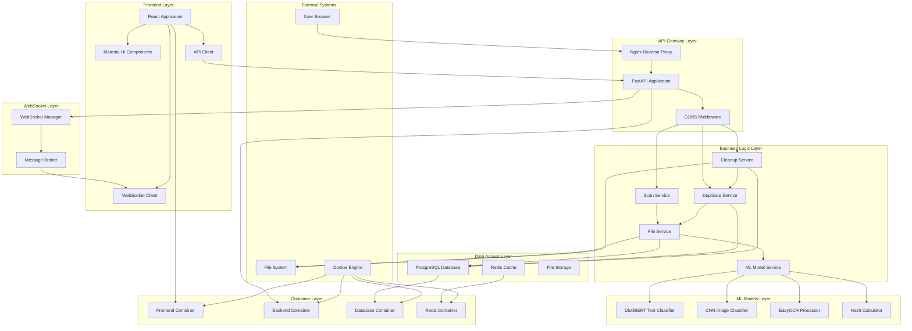

# Component Diagram - AI File Management System

## Mermaid Diagram



## Description

Shows the system components and their relationships.

## Source

This diagram is maintained in `diagrams/mermaid/03_component.mmd`.

To update this diagram:
1. Edit the source file: `diagrams/mermaid/03_component.mmd`
2. Run: `node diagrams/generate-definitions.js`
3. This will update both the React component and this markdown file

## Usage

### In React Application
The diagram is automatically available in the UML Diagrams component at `/uml-diagrams`.

### In Documentation
Include in documentation by referencing the mermaid file:

```markdown
```mermaid

```
```

### Direct Mermaid Usage
You can also directly include the mermaid file in any mermaid-compatible renderer:

```
graph TB
    %% External Systems
    subgraph "External Systems"
        User[User Browser]
        FileSystem[File System]
        Docker[Docker Engine]
    end

    %% Frontend Layer
    subgraph "Frontend Layer"
        ReactApp[React Application]
        MaterialUI[Material-UI Components]
        WebSocketClient[WebSocket Client]
        ApiClient[API Client]
    end

    %% API Gateway Layer
    subgraph "API Gateway Layer"
        Nginx[Nginx Reverse Proxy]
        FastAPI[FastAPI Application]
        CORS[CORS Middleware]
    end

    %% Business Logic Layer
    subgraph "Business Logic Layer"
        ScanService[Scan Service]
        DuplicateService[Duplicate Service]
        CleanupService[Cleanup Service]
        FileService[File Service]
        MLService[ML Model Service]
    end

    %% ML Models Layer
    subgraph "ML Models Layer"
        TextClassifier[DistilBERT Text Classifier]
        ImageClassifier[CNN Image Classifier]
        OCRProcessor[EasyOCR Processor]
        HashCalculator[Hash Calculator]
    end

    %% Data Access Layer
    subgraph "Data Access Layer"
        Database[PostgreSQL Database]
        Redis[Redis Cache]
        FileStorage[File Storage]
    end

    %% WebSocket Layer
    subgraph "WebSocket Layer"
        WebSocketManager[WebSocket Manager]
        MessageBroker[Message Broker]
    end

    %% Container Layer
    subgraph "Container Layer"
        FrontendContainer[Frontend Container]
        BackendContainer[Backend Container]
        DatabaseContainer[Database Container]
        RedisContainer[Redis Container]
    end

    %% Connections
    User --> Nginx
    Nginx --> FastAPI
    FastAPI --> CORS
    CORS --> ScanService
    CORS --> DuplicateService
    CORS --> CleanupService

    ScanService --> FileService
    DuplicateService --> FileService
    CleanupService --> DuplicateService

    FileService --> MLService
    FileService --> FileSystem
    FileService --> Database

    MLService --> TextClassifier
    MLService --> ImageClassifier
    MLService --> OCRProcessor
    MLService --> HashCalculator

    DuplicateService --> Database
    CleanupService --> Database
    CleanupService --> FileSystem

    FastAPI --> WebSocketManager
    WebSocketManager --> MessageBroker
    MessageBroker --> WebSocketClient

    ReactApp --> MaterialUI
    ReactApp --> WebSocketClient
    ReactApp --> ApiClient
    ApiClient --> FastAPI

    Database --> DatabaseContainer
    Redis --> RedisContainer
    FastAPI --> BackendContainer
    ReactApp --> FrontendContainer

    Docker --> FrontendContainer
    Docker --> BackendContainer
    Docker --> DatabaseContainer
    Docker --> RedisContainer
```
