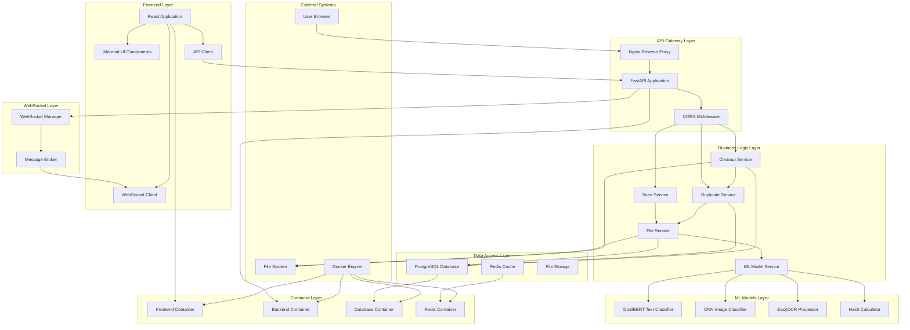

# Component Diagram - AI File Management System

## Mermaid Diagram



## ASCII Art Diagram

```
┌─────────────────────────────────────────────────────────────────┐
│                    AI File Management System                    │
│                      Component Diagram                         │
└─────────────────────────────────────────────────────────────────┘

┌─────────────────────────────────────────────────────────────────┐
│                        External Systems                        │
└─────────────────────────────────────────────────────────────────┘

    [User Browser]    [File System]    [Docker Engine]

┌─────────────────────────────────────────────────────────────────┐
│                        Frontend Layer                          │
└─────────────────────────────────────────────────────────────────┘

    [React App] ──→ [Material-UI] ──→ [WebSocket Client]
           │
           └──→ [API Client]

┌─────────────────────────────────────────────────────────────────┐
│                      API Gateway Layer                         │
└─────────────────────────────────────────────────────────────────┘

    [Nginx] ──→ [FastAPI] ──→ [CORS Middleware]

┌─────────────────────────────────────────────────────────────────┐
│                    Business Logic Layer                        │
└─────────────────────────────────────────────────────────────────┘

    [Scan Service] ──→ [File Service]
           │
    [Duplicate Service] ──→ [ML Service]
           │
    [Cleanup Service]

┌─────────────────────────────────────────────────────────────────┐
│                      ML Models Layer                           │
└─────────────────────────────────────────────────────────────────┘

    [Text Classifier] ──→ [DistilBERT]
    [Image Classifier] ──→ [CNN]
    [OCR Processor] ──→ [EasyOCR]
    [Hash Calculator]

┌─────────────────────────────────────────────────────────────────┐
│                      Data Access Layer                         │
└─────────────────────────────────────────────────────────────────┘

    [PostgreSQL] ──→ [File Storage]
    [Redis Cache]

┌─────────────────────────────────────────────────────────────────┐
│                      WebSocket Layer                           │
└─────────────────────────────────────────────────────────────────┘

    [WebSocket Manager] ──→ [Message Broker]

┌─────────────────────────────────────────────────────────────────┐
│                      Container Layer                           │
└─────────────────────────────────────────────────────────────────┘

    [Frontend Container] ──→ [Backend Container]
    [Database Container] ──→ [Redis Container]

Connections:
- User Browser → Nginx (HTTPS)
- Nginx → React App (HTTP)
- Nginx → FastAPI (HTTP)
- FastAPI → Services (Internal)
- Services → ML Models (Internal)
- Services → Database (SQL)
- Services → Redis (Protocol)
- FastAPI → WebSocket Manager (Internal)
- WebSocket Manager → React App (WebSocket)
```

## Draw.io Instructions

### Step 1: Create Component Groups
1. Open Draw.io
2. Use **Component Diagram** template
3. Create grouped rectangles for each layer:
   - External Systems
   - Frontend Layer
   - API Gateway Layer
   - Business Logic Layer
   - ML Models Layer
   - Data Access Layer
   - WebSocket Layer
   - Container Layer

### Step 2: Add Components
Within each group, add components as rectangles:
- Use **<<component>>** stereotype
- Add component names
- Use different colors for different types

### Step 3: Add Interfaces
- Create **Interface** shapes (circles or lollipops)
- Attach to components that provide/require interfaces
- Use **Provided Interface** (circle) and **Required Interface** (half-circle)

### Step 4: Add Dependencies
- Use **Dependency** arrows (dashed lines with arrow)
- Show which components depend on others
- Use **Assembly** connectors (solid lines) for direct connections

### Step 5: Add Ports
- Add **Port** shapes to components
- Show external interfaces
- Connect ports with assembly connectors

### Step 6: Add Notes and Annotations
- Add **Note** shapes for important information
- Use **Constraint** shapes for technical requirements
- Add **Comment** shapes for explanations

## Component Descriptions

### Frontend Components
- **React Application**: Main UI application
- **Material-UI Components**: UI component library
- **WebSocket Client**: Real-time communication
- **API Client**: HTTP communication with backend

### Backend Components
- **FastAPI Application**: Main API server
- **Scan Service**: File scanning logic
- **Duplicate Service**: Duplicate detection logic
- **Cleanup Service**: File cleanup operations
- **File Service**: File operations and metadata
- **ML Service**: Machine learning model coordination

### ML Components
- **Text Classifier**: DistilBERT for text classification
- **Image Classifier**: CNN for image classification
- **OCR Processor**: EasyOCR for text extraction
- **Hash Calculator**: File hashing utilities

### Data Components
- **PostgreSQL Database**: Primary data storage
- **Redis Cache**: Caching and session storage
- **File Storage**: File system access

### Infrastructure Components
- **Nginx**: Reverse proxy and load balancer
- **Docker**: Containerization platform
- **WebSocket Manager**: Real-time communication management
