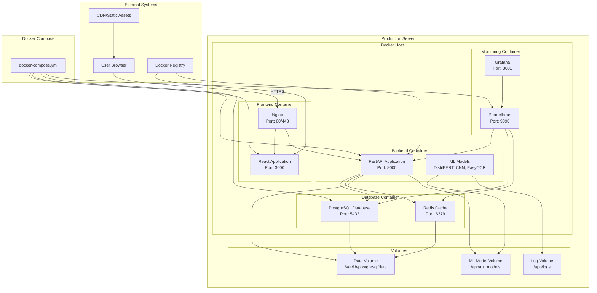

# Deployment Diagram - AI File Management System

## Mermaid Diagram



## Description

Shows the deployment architecture and infrastructure components.

## Source

This diagram is maintained in `diagrams/mermaid/04_deployment.mmd`.

To update this diagram:
1. Edit the source file: `diagrams/mermaid/04_deployment.mmd`
2. Run: `node diagrams/generate-definitions.js`
3. This will update both the React component and this markdown file

## Usage

### In React Application
The diagram is automatically available in the UML Diagrams component at `/uml-diagrams`.

### In Documentation
Include in documentation by referencing the mermaid file:

```markdown
```mermaid

```
```

### Direct Mermaid Usage
You can also directly include the mermaid file in any mermaid-compatible renderer:

```
graph TB
    %% Physical Infrastructure
    subgraph "Production Server"
        subgraph "Docker Host"
            subgraph "Frontend Container"
                ReactApp[React Application<br/>Port: 3000]
                NginxFrontend[Nginx<br/>Port: 80/443]
            end
            
            subgraph "Backend Container"
                FastAPI[FastAPI Application<br/>Port: 8000]
                MLModels[ML Models<br/>DistilBERT, CNN, EasyOCR]
            end
            
            subgraph "Database Container"
                PostgreSQL[PostgreSQL Database<br/>Port: 5432]
                Redis[Redis Cache<br/>Port: 6379]
            end
            
            subgraph "Monitoring Container"
                Prometheus[Prometheus<br/>Port: 9090]
                Grafana[Grafana<br/>Port: 3001]
            end
        end
        
        subgraph "Volumes"
            DataVolume[Data Volume<br/>/var/lib/postgresql/data]
            MLModelVolume[ML Model Volume<br/>/app/ml_models]
            LogVolume[Log Volume<br/>/app/logs]
        end
    end

    %% External Connections
    subgraph "External Systems"
        User[User Browser]
        CDN[CDN/Static Assets]
        DockerRegistry[Docker Registry]
    end

    %% Network Connections
    User -->|HTTPS| NginxFrontend
    NginxFrontend --> ReactApp
    NginxFrontend --> FastAPI
    
    FastAPI --> PostgreSQL
    FastAPI --> Redis
    FastAPI --> DataVolume
    FastAPI --> MLModelVolume
    
    MLModels --> MLModelVolume
    MLModels --> LogVolume
    
    PostgreSQL --> DataVolume
    Redis --> DataVolume
    
    Prometheus --> FastAPI
    Prometheus --> PostgreSQL
    Prometheus --> Redis
    Grafana --> Prometheus
    
    DockerRegistry --> ReactApp
    DockerRegistry --> FastAPI
    CDN --> User

    %% Container Orchestration
    subgraph "Docker Compose"
        ComposeFile[docker-compose.yml]
        ComposeFile --> ReactApp
        ComposeFile --> FastAPI
        ComposeFile --> PostgreSQL
        ComposeFile --> Prometheus
    end
```
