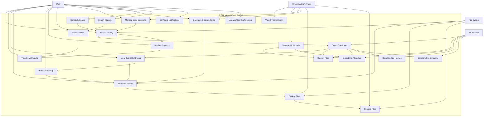

# Use Case Diagram - AI File Management System

## Mermaid Diagram



## Description

Shows the interactions between users and the system use cases.

## Source

This diagram is maintained in `diagrams/mermaid/05_use_case.mmd`.

To update this diagram:
1. Edit the source file: `diagrams/mermaid/05_use_case.mmd`
2. Run: `node diagrams/generate-definitions.js`
3. This will update both the React component and this markdown file

## Usage

### In React Application
The diagram is automatically available in the UML Diagrams component at `/uml-diagrams`.

### In Documentation
Include in documentation by referencing the mermaid file:

```markdown
```mermaid

```
```

### Direct Mermaid Usage
You can also directly include the mermaid file in any mermaid-compatible renderer:

```
graph TB
    %% Actors
    User[User]
    Admin[System Administrator]
    MLSystem[ML System]
    FileSystem[File System]

    %% System Boundary
    subgraph "AI File Management System"
        %% Core Use Cases
        UC1[Scan Directory]
        UC2[View Scan Results]
        UC3[Detect Duplicates]
        UC4[View Duplicate Groups]
        UC5[Execute Cleanup]
        UC6[Preview Cleanup]
        UC7[Monitor Progress]
        UC8[View Statistics]
        
        %% File Management Use Cases
        UC9[Classify Files]
        UC10[Extract File Metadata]
        UC11[Calculate File Hashes]
        UC12[Compare File Similarity]
        
        %% System Management Use Cases
        UC13[Manage Scan Sessions]
        UC14[Configure Cleanup Rules]
        UC15[Backup Files]
        UC16[Restore Files]
        UC17[View System Health]
        UC18[Manage ML Models]
        
        %% Advanced Use Cases
        UC19[Schedule Scans]
        UC20[Export Reports]
        UC21[Configure Notifications]
        UC22[Manage User Preferences]
    end

    %% Actor-Use Case Relationships
    User --> UC1
    User --> UC2
    User --> UC4
    User --> UC5
    User --> UC6
    User --> UC7
    User --> UC8
    User --> UC13
    User --> UC14
    User --> UC19
    User --> UC20
    User --> UC21
    User --> UC22

    Admin --> UC17
    Admin --> UC18
    Admin --> UC13
    Admin --> UC14
    Admin --> UC15
    Admin --> UC16

    MLSystem --> UC3
    MLSystem --> UC9
    MLSystem --> UC10
    MLSystem --> UC11
    MLSystem --> UC12

    FileSystem --> UC1
    FileSystem --> UC5
    FileSystem --> UC15
    FileSystem --> UC16

    %% Use Case Relationships
    UC1 --> UC3
    UC1 --> UC7
    UC3 --> UC4
    UC3 --> UC9
    UC3 --> UC10
    UC3 --> UC11
    UC3 --> UC12
    UC4 --> UC5
    UC4 --> UC6
    UC5 --> UC15
    UC6 --> UC5
    UC7 --> UC2
    UC8 --> UC2
    UC13 --> UC1
    UC14 --> UC5
    UC15 --> UC16
    UC18 --> UC9
    UC18 --> UC10
    UC19 --> UC1
    UC20 --> UC8
```
