# Use Case Diagram - AI File Management System

## Mermaid Diagram

```mermaid
graph TB
    %% Actors
    User[👤 User]
    Admin[👨‍💼 System Administrator]
    MLSystem[🤖 ML System]
    FileSystem[📁 File System]

    %% System Boundary
    subgraph "AI File Management System"
        %% Core Use Cases
        UC1[Scan Directory]
        UC2[View Scan Results]
        UC3[Detect Duplicates]
        UC4[View Duplicate Groups]
        UC5[Execute Cleanup]
        UC6[Preview Cleanup]
        UC7[Monitor Progress]
        UC8[View Statistics]
        
        %% File Management Use Cases
        UC9[Classify Files]
        UC10[Extract File Metadata]
        UC11[Calculate File Hashes]
        UC12[Compare File Similarity]
        
        %% System Management Use Cases
        UC13[Manage Scan Sessions]
        UC14[Configure Cleanup Rules]
        UC15[Backup Files]
        UC16[Restore Files]
        UC17[View System Health]
        UC18[Manage ML Models]
        
        %% Advanced Use Cases
        UC19[Schedule Scans]
        UC20[Export Reports]
        UC21[Configure Notifications]
        UC22[Manage User Preferences]
    end

    %% Actor-Use Case Relationships
    User --> UC1
    User --> UC2
    User --> UC4
    User --> UC5
    User --> UC6
    User --> UC7
    User --> UC8
    User --> UC13
    User --> UC14
    User --> UC19
    User --> UC20
    User --> UC21
    User --> UC22

    Admin --> UC17
    Admin --> UC18
    Admin --> UC13
    Admin --> UC14
    Admin --> UC15
    Admin --> UC16

    MLSystem --> UC3
    MLSystem --> UC9
    MLSystem --> UC10
    MLSystem --> UC11
    MLSystem --> UC12

    FileSystem --> UC1
    FileSystem --> UC5
    FileSystem --> UC15
    FileSystem --> UC16

    %% Use Case Relationships
    UC1 --> UC3
    UC1 --> UC7
    UC3 --> UC4
    UC3 --> UC9
    UC3 --> UC10
    UC3 --> UC11
    UC3 --> UC12
    UC4 --> UC5
    UC4 --> UC6
    UC5 --> UC15
    UC6 --> UC5
    UC7 --> UC2
    UC8 --> UC2
    UC13 --> UC1
    UC14 --> UC5
    UC15 --> UC16
    UC18 --> UC9
    UC18 --> UC10
    UC19 --> UC1
    UC20 --> UC8
```



## ASCII Art Diagram

```
┌─────────────────────────────────────────────────────────────────┐
│                    AI File Management System                    │
│                      Use Case Diagram                         │
└─────────────────────────────────────────────────────────────────┘

                    👤 User
                      │
                      ▼
    ┌─────────────────────────────────────────────────────────┐
    │              AI File Management System                  │
    │                                                         │
    │  ┌─────────────┐  ┌─────────────┐  ┌─────────────┐     │
    │  │ Scan        │  │ View        │  │ Detect      │     │
    │  │ Directory   │  │ Results     │  │ Duplicates  │     │
    │  └─────────────┘  └─────────────┘  └─────────────┘     │
    │         │               │               │               │
    │         ▼               ▼               ▼               │
    │  ┌─────────────┐  ┌─────────────┐  ┌─────────────┐     │
    │  │ View        │  │ Execute     │  │ Preview     │     │
    │  │ Duplicates  │  │ Cleanup     │  │ Cleanup     │     │
    │  └─────────────┘  └─────────────┘  └─────────────┘     │
    │         │               │               │               │
    │         ▼               ▼               ▼               │
    │  ┌─────────────┐  ┌─────────────┐  ┌─────────────┐     │
    │  │ Monitor     │  │ View        │  │ Manage      │     │
    │  │ Progress    │  │ Statistics  │  │ Sessions    │     │
    │  └─────────────┘  └─────────────┘  └─────────────┘     │
    │                                                         │
    │  ┌─────────────┐  ┌─────────────┐  ┌─────────────┐     │
    │  │ Configure   │  │ Schedule    │  │ Export      │     │
    │  │ Rules       │  │ Scans       │  │ Reports     │     │
    │  └─────────────┘  └─────────────┘  └─────────────┘     │
    └─────────────────────────────────────────────────────────┘
                      ▲
                      │
              👨‍💼 System Administrator

External Systems:

🤖 ML System ──→ [Classify Files] ──→ [Extract Metadata]
📁 File System ──→ [Scan Directory] ──→ [Execute Cleanup]

Use Case Relationships:
- Scan Directory includes Detect Duplicates
- Detect Duplicates includes Classify Files
- Execute Cleanup includes Backup Files
- Preview Cleanup extends Execute Cleanup
- Monitor Progress extends Scan Directory
- Export Reports extends View Statistics
```

## Draw.io Instructions

### Step 1: Create Actors
1. Open Draw.io
2. Use **Use Case Diagram** template
3. Create **Actor** shapes (stick figures) for:
   - User (primary actor)
   - System Administrator
   - ML System (external system)
   - File System (external system)

### Step 2: Create System Boundary
- Draw a large rectangle around the use cases
- Label it "AI File Management System"
- Place all use cases inside this boundary

### Step 3: Add Use Cases
Create **Use Case** shapes (ellipses) for each use case:
- Use descriptive names
- Group related use cases
- Use different colors for different categories

### Step 4: Add Relationships
- **Association** (solid line): Actor to Use Case
- **Include** (dashed line with <<include>>): One use case includes another
- **Extend** (dashed line with <<extend>>): One use case extends another
- **Generalization** (solid line with arrow): Inheritance relationships

### Step 5: Add Use Case Categories
Group use cases by color or position:
- **Core Features**: Scan, Detect, Cleanup
- **File Management**: Classify, Metadata, Hashes
- **System Management**: Sessions, Rules, Backup
- **Advanced Features**: Schedule, Export, Configure

### Step 6: Add Notes and Constraints
- Add **Note** shapes for important information
- Include **Constraint** shapes for business rules
- Add **Comment** shapes for explanations

## Use Case Descriptions

### Primary Use Cases

#### UC1: Scan Directory
- **Actor**: User
- **Description**: User initiates a scan of a specified directory
- **Preconditions**: Valid directory path provided
- **Main Flow**: 
  1. User enters directory path
  2. System validates path
  3. System starts background scan
  4. System processes files
  5. System detects duplicates
  6. System displays results
- **Postconditions**: Scan results available for review

#### UC3: Detect Duplicates
- **Actor**: ML System
- **Description**: System automatically detects duplicate files
- **Preconditions**: Files have been scanned and processed
- **Main Flow**:
  1. System compares file hashes
  2. System calculates similarity scores
  3. System groups similar files
  4. System creates duplicate groups
- **Postconditions**: Duplicate groups created and stored

#### UC5: Execute Cleanup
- **Actor**: User
- **Description**: User removes duplicate files based on rules
- **Preconditions**: Duplicate groups identified
- **Main Flow**:
  1. User selects cleanup rules
  2. System previews actions
  3. User confirms cleanup
  4. System backs up files
  5. System deletes duplicates
  6. System updates database
- **Postconditions**: Duplicates removed, space recovered

### Secondary Use Cases

#### UC9: Classify Files
- **Actor**: ML System
- **Description**: System classifies files by type and category
- **Preconditions**: File metadata extracted
- **Main Flow**:
  1. System analyzes file content
  2. System applies ML models
  3. System determines file type
  4. System assigns category
- **Postconditions**: File classification completed

#### UC17: View System Health
- **Actor**: System Administrator
- **Description**: Admin monitors system status and performance
- **Preconditions**: System is running
- **Main Flow**:
  1. Admin accesses health dashboard
  2. System displays metrics
  3. Admin reviews performance
  4. Admin takes action if needed
- **Postconditions**: System status known

### Use Case Relationships

#### Include Relationships
- UC1 includes UC3 (Scan includes Detect Duplicates)
- UC3 includes UC9 (Detect includes Classify)
- UC5 includes UC15 (Cleanup includes Backup)

#### Extend Relationships
- UC6 extends UC5 (Preview extends Cleanup)
- UC7 extends UC1 (Monitor extends Scan)
- UC20 extends UC8 (Export extends View Statistics)

#### Generalization Relationships
- UC15 generalizes UC16 (Backup generalizes Restore)
- UC13 generalizes UC1 (Manage Sessions generalizes Scan)
