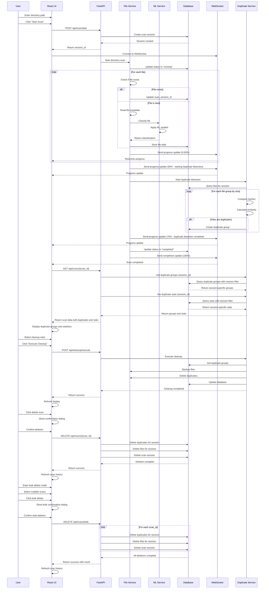

# Sequence Diagram - AI File Management System

## Mermaid Diagram



## Description

Shows the interaction between objects over time during scan and cleanup processes.

## Source

This diagram is maintained in `diagrams/mermaid/06_sequence.mmd`.

To update this diagram:
1. Edit the source file: `diagrams/mermaid/06_sequence.mmd`
2. Run: `node diagrams/generate-definitions.js`
3. This will update both the React component and this markdown file

## Usage

### In React Application
The diagram is automatically available in the UML Diagrams component at `/uml-diagrams`.

### In Documentation
Include in documentation by referencing the mermaid file:

```markdown
```mermaid

```
```

### Direct Mermaid Usage
You can also directly include the mermaid file in any mermaid-compatible renderer:

```
sequenceDiagram
    participant U as User
    participant UI as React UI
    participant API as FastAPI
    participant FS as File Service
    participant ML as ML Service
    participant DB as Database
    participant WS as WebSocket
    participant DS as Duplicate Service

    %% Scan Process
    U->>UI: Enter directory path
    U->>UI: Click "Start Scan"
    UI->>API: POST /api/scan/start
    API->>DB: Create scan session
    DB-->>API: Session created
    API-->>UI: Return session_id
    UI->>WS: Connect to WebSocket
    
    %% Background Processing
    API->>FS: Start directory scan
    FS->>DB: Update status to "running"
    loop For each file
        FS->>FS: Check if file exists
        alt File exists
            FS->>DB: Update scan_session_id
        else File is new
            FS->>FS: Read file metadata
            FS->>ML: Classify file
            ML->>ML: Apply ML models
            ML-->>FS: Return classification
            FS->>DB: Store file data
        end
        FS->>WS: Send progress update (0-50%)
        WS-->>UI: Real-time progress
    end
    
    %% Duplicate Detection
    FS->>WS: Send progress update (50% - starting duplicate detection)
    WS-->>UI: Progress update
    FS->>DS: Start duplicate detection
    DS->>DB: Query files for session
    loop For each file group by size
        DS->>DS: Compare hashes
        DS->>DS: Calculate similarity
        alt Files are duplicates
            DS->>DB: Create duplicate group
        end
    end
    FS->>WS: Send progress update (75% - duplicate detection complete)
    WS-->>UI: Progress update
    FS->>DB: Update status to "completed"
    FS->>WS: Send completion update (100%)
    WS-->>UI: Scan completed
    
    %% Display Results
    UI->>API: GET /api/scans/{scan_id}
    API->>DS: Get duplicate groups (session_id)
    DS->>DB: Query duplicate groups with session filter
    DB-->>DS: Return session-specific groups
    API->>DS: Get duplicate stats (session_id)
    DS->>DB: Query stats with session filter
    DB-->>DS: Return session-specific stats
    DS-->>API: Return groups and stats
    API-->>UI: Return scan data with duplicates and stats
    UI->>UI: Display duplicate groups and statistics
    
    %% Cleanup Process
    U->>UI: Select cleanup rules
    U->>UI: Click "Execute Cleanup"
    UI->>API: POST /api/cleanup/execute
    API->>DS: Execute cleanup
    DS->>DB: Get duplicate groups
    DS->>FS: Backup files
    DS->>FS: Delete duplicates
    DS->>DB: Update database
    DS-->>API: Cleanup completed
    API-->>UI: Return success
    UI->>UI: Refresh display
    
    %% Scan History Deletion
    U->>UI: Click delete scan
    UI->>UI: Show confirmation dialog
    U->>UI: Confirm deletion
    UI->>API: DELETE /api/scans/{scan_id}
    API->>DB: Delete duplicates for session
    API->>DB: Delete files for session
    API->>DB: Delete scan session
    DB-->>API: Deletion complete
    API-->>UI: Return success
    UI->>UI: Refresh scan history
    
    %% Bulk Scan Deletion
    U->>UI: Enter bulk delete mode
    U->>UI: Select multiple scans
    U->>UI: Click bulk delete
    UI->>UI: Show bulk confirmation dialog
    U->>UI: Confirm bulk deletion
    UI->>API: DELETE /api/scans/bulk
    loop For each scan_id
        API->>DB: Delete duplicates for session
        API->>DB: Delete files for session
        API->>DB: Delete scan session
    end
    DB-->>API: All deletions complete
    API-->>UI: Return success with count
    UI->>UI: Refresh scan history
```
