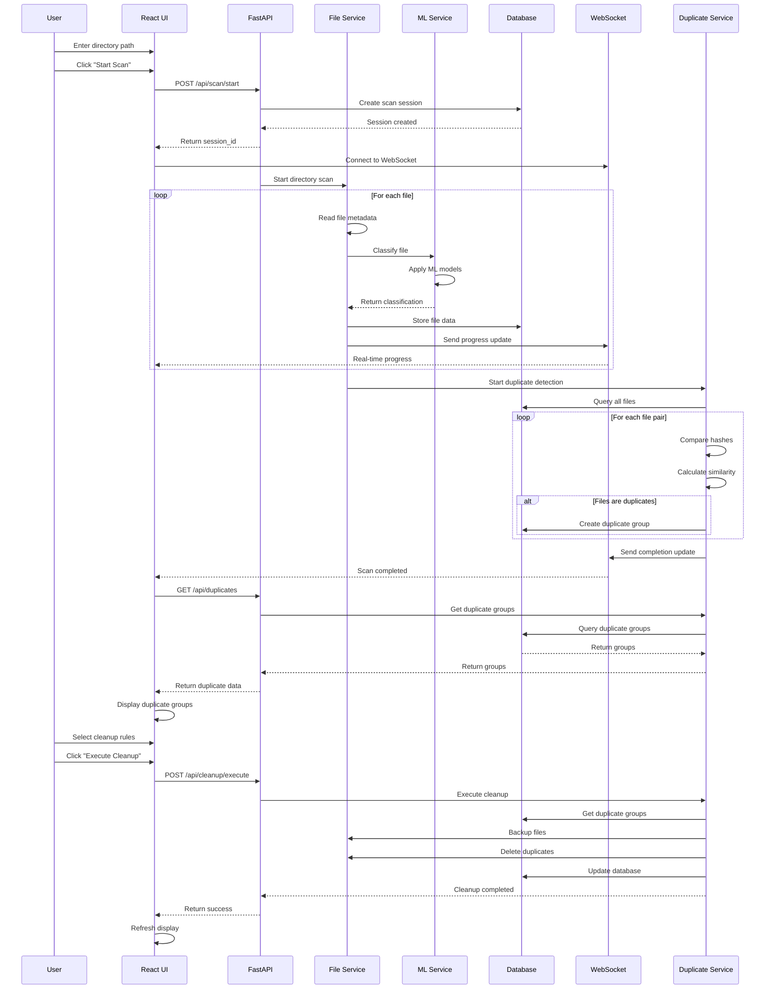

# Sequence Diagram - AI File Management System

## Mermaid Diagram



## ASCII Art Diagram

```
┌─────────────────────────────────────────────────────────────────┐
│                    AI File Management System                    │
│                      Sequence Diagram                          │
└─────────────────────────────────────────────────────────────────┘

User    UI      API     File    ML     DB     WS     Duplicate
 │      │       │       │       │      │      │      │
 │      │       │       │       │      │      │      │
 │─────▶│       │       │       │      │      │      │  Enter path
 │      │       │       │       │      │      │      │
 │      │──────▶│       │       │      │      │      │  Start scan
 │      │       │       │       │      │      │      │
 │      │       │──────▶│       │      │      │      │  Create session
 │      │       │       │       │      │      │      │
 │      │       │◀──────│       │      │      │      │  Session created
 │      │◀──────│       │       │      │      │      │  Return session_id
 │      │       │       │       │      │      │      │
 │      │──────▶│       │       │      │      │      │  Connect WebSocket
 │      │       │       │       │      │      │      │
 │      │       │       │       │      │      │      │
 │      │       │──────▶│       │      │      │      │  Start scan
 │      │       │       │       │      │      │      │
 │      │       │       │       │      │      │      │
 │      │       │       │──────▶│      │      │      │  Process file
 │      │       │       │       │      │      │      │
 │      │       │       │──────▶│      │      │      │  Classify file
 │      │       │       │       │      │      │      │
 │      │       │       │◀──────│      │      │      │  Classification
 │      │       │       │       │      │      │      │
 │      │       │       │──────▶│      │      │      │  Store in DB
 │      │       │       │       │      │      │      │
 │      │       │       │──────▶│      │      │      │  Send progress
 │      │       │       │       │      │      │      │
 │      │◀──────│       │       │      │      │      │  Real-time update
 │      │       │       │       │      │      │      │
 │      │       │       │       │      │      │      │
 │      │       │       │──────▶│      │      │      │  Detect duplicates
 │      │       │       │       │      │      │      │
 │      │       │       │──────▶│      │      │      │  Query files
 │      │       │       │       │      │      │      │
 │      │       │       │◀──────│      │      │      │  Return files
 │      │       │       │       │      │      │      │
 │      │       │       │       │      │      │      │  Compare hashes
 │      │       │       │       │      │      │      │
 │      │       │       │──────▶│      │      │      │  Create groups
 │      │       │       │       │      │      │      │
 │      │       │       │──────▶│      │      │      │  Send completion
 │      │       │       │       │      │      │      │
 │      │◀──────│       │       │      │      │      │  Scan completed
 │      │       │       │       │      │      │      │
 │      │       │       │       │      │      │      │
 │      │──────▶│       │       │      │      │      │  Get duplicates
 │      │       │       │       │      │      │      │
 │      │       │──────▶│       │      │      │      │  Query groups
 │      │       │       │       │      │      │      │
 │      │       │◀──────│       │      │      │      │  Return groups
 │      │◀──────│       │       │      │      │      │  Display results
 │      │       │       │       │      │      │      │
 │      │       │       │       │      │      │      │
 │─────▶│       │       │       │      │      │      │  Select cleanup
 │      │       │       │       │      │      │      │
 │      │──────▶│       │       │      │      │      │  Execute cleanup
 │      │       │       │       │      │      │      │
 │      │       │──────▶│       │      │      │      │  Get groups
 │      │       │       │       │      │      │      │
 │      │       │       │──────▶│      │      │      │  Backup files
 │      │       │       │       │      │      │      │
 │      │       │       │──────▶│      │      │      │  Delete duplicates
 │      │       │       │       │      │      │      │
 │      │       │       │──────▶│      │      │      │  Update database
 │      │       │       │       │      │      │      │
 │      │       │◀──────│       │      │      │      │  Cleanup completed
 │      │◀──────│       │       │      │      │      │  Success response
 │      │       │       │       │      │      │      │
 │      │       │       │       │      │      │      │  Refresh UI
```

## Draw.io Instructions

### Step 1: Create Lifelines
1. Open Draw.io
2. Use **Sequence Diagram** template
3. Create **Lifeline** shapes for each participant:
   - User
   - React UI
   - FastAPI
   - File Service
   - ML Service
   - Database
   - WebSocket
   - Duplicate Service

### Step 2: Add Messages
- Use **Message** arrows for communication
- **Synchronous** (solid line with arrow): Direct calls
- **Asynchronous** (dashed line with arrow): Async calls
- **Return** (dashed line): Return values
- **Self-call** (loop back to same lifeline): Internal processing

### Step 3: Add Activation Boxes
- Add **Activation** rectangles on lifelines
- Show when objects are active
- Stack activations for nested calls
- Use different colors for different processes

### Step 4: Add Loops and Conditions
- Use **Loop** frames for repetitive processes
- Use **Alt** frames for conditional logic
- Use **Opt** frames for optional processes
- Use **Par** frames for parallel processes

### Step 5: Add Notes and Comments
- Add **Note** shapes for explanations
- Use **Comment** shapes for important details
- Add **Constraint** shapes for timing requirements
- Include **State** shapes for object states

### Step 6: Add Time Constraints
- Add timing information on messages
- Use **Duration** constraints
- Show **Time** annotations
- Include **Deadline** constraints

## Key Interactions

### Scan Process
1. **User Input**: User provides directory path
2. **API Call**: UI sends scan request to backend
3. **Session Creation**: Backend creates scan session
4. **File Processing**: Background processing of files
5. **ML Classification**: Files classified using ML models
6. **Progress Updates**: Real-time updates via WebSocket
7. **Duplicate Detection**: Automatic duplicate detection
8. **Results Display**: UI shows scan results

### Cleanup Process
1. **Rule Selection**: User selects cleanup rules
2. **Preview**: System shows what will be deleted
3. **Confirmation**: User confirms cleanup action
4. **Backup**: Files backed up before deletion
5. **Deletion**: Duplicate files removed
6. **Database Update**: Database updated with changes
7. **UI Refresh**: Interface updated with results

### Error Handling
- **Validation Errors**: Invalid directory paths
- **Processing Errors**: File access issues
- **ML Errors**: Model loading failures
- **Database Errors**: Connection issues
- **WebSocket Errors**: Connection drops

### Performance Considerations
- **Async Processing**: Non-blocking file operations
- **Progress Tracking**: Real-time progress updates
- **Batch Operations**: Efficient database operations
- **Caching**: Redis for performance optimization
- **Resource Management**: Memory and CPU optimization
