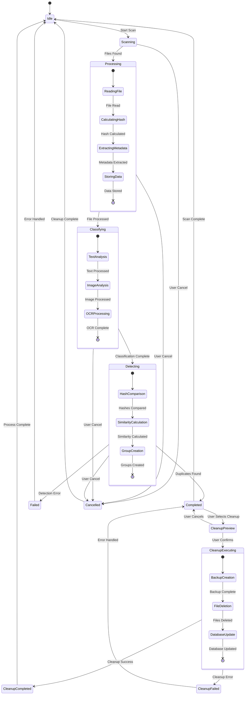

# State Diagram - AI File Management System

## Mermaid Diagram



## Description

Shows the different states of the system and transitions between them.

## Source

This diagram is maintained in `diagrams/mermaid/07_state.mmd`.

To update this diagram:
1. Edit the source file: `diagrams/mermaid/07_state.mmd`
2. Run: `node diagrams/generate-definitions.js`
3. This will update both the React component and this markdown file

## Usage

### In React Application
The diagram is automatically available in the UML Diagrams component at `/uml-diagrams`.

### In Documentation
Include in documentation by referencing the mermaid file:

```markdown
```mermaid

```
```

### Direct Mermaid Usage
You can also directly include the mermaid file in any mermaid-compatible renderer:

```
stateDiagram-v2
    [*] --> Idle
    
    Idle --> Scanning : Start Scan
    Scanning --> Processing : Files Found
    Processing --> Classifying : File Processed
    Classifying --> Detecting : Classification Complete
    Detecting --> Completed : Duplicates Found
    Detecting --> Failed : Detection Error
    Completed --> Idle : Scan Complete
    Failed --> Idle : Error Handled
    
    Scanning --> Cancelled : User Cancel
    Processing --> Cancelled : User Cancel
    Classifying --> Cancelled : User Cancel
    Detecting --> Cancelled : User Cancel
    Cancelled --> Idle : Cleanup Complete
    
    Completed --> CleanupPreview : User Selects Cleanup
    CleanupPreview --> CleanupExecuting : User Confirms
    CleanupPreview --> Completed : User Cancels
    CleanupExecuting --> CleanupCompleted : Cleanup Success
    CleanupExecuting --> CleanupFailed : Cleanup Error
    CleanupCompleted --> Idle : Process Complete
    CleanupFailed --> Completed : Error Handled
    
    %% Sub-states for Processing
    state Processing {
        [*] --> ReadingFile
        ReadingFile --> CalculatingHash : File Read
        CalculatingHash --> ExtractingMetadata : Hash Calculated
        ExtractingMetadata --> StoringData : Metadata Extracted
        StoringData --> [*] : Data Stored
    }
    
    %% Sub-states for Classifying
    state Classifying {
        [*] --> TextAnalysis
        TextAnalysis --> ImageAnalysis : Text Processed
        ImageAnalysis --> OCRProcessing : Image Processed
        OCRProcessing --> [*] : OCR Complete
    }
    
    %% Sub-states for Detecting
    state Detecting {
        [*] --> HashComparison
        HashComparison --> SimilarityCalculation : Hashes Compared
        SimilarityCalculation --> GroupCreation : Similarity Calculated
        GroupCreation --> [*] : Groups Created
    }
    
    %% Sub-states for Cleanup
    state CleanupExecuting {
        [*] --> BackupCreation
        BackupCreation --> FileDeletion : Backup Complete
        FileDeletion --> DatabaseUpdate : Files Deleted
        DatabaseUpdate --> [*] : Database Updated
    }
```
