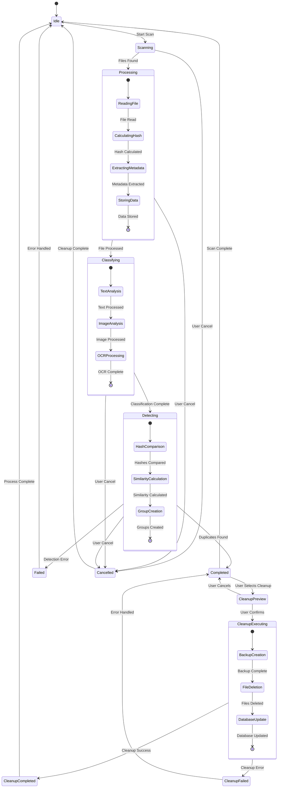

# State Diagram - AI File Management System

## Mermaid Diagram



## ASCII Art Diagram

```
┌─────────────────────────────────────────────────────────────────┐
│                    AI File Management System                    │
│                       State Diagram                            │
└─────────────────────────────────────────────────────────────────┘

                    [*] ──→ Idle
                             │
                             ▼
                    [Start Scan] ──→ Scanning
                             │
                             ▼
                    [Files Found] ──→ Processing
                             │
                             ▼
                    [File Processed] ──→ Classifying
                             │
                             ▼
                    [Classification Complete] ──→ Detecting
                             │
                             ▼
                    [Duplicates Found] ──→ Completed
                             │
                             ▼
                    [Scan Complete] ──→ Idle
                             │
                             ▼
                    [User Selects Cleanup] ──→ CleanupPreview
                             │
                             ▼
                    [User Confirms] ──→ CleanupExecuting
                             │
                             ▼
                    [Cleanup Success] ──→ CleanupCompleted
                             │
                             ▼
                    [Process Complete] ──→ Idle

Error Flows:
    Scanning ──→ [Error] ──→ Failed ──→ Idle
    Processing ──→ [Error] ──→ Failed ──→ Idle
    Classifying ──→ [Error] ──→ Failed ──→ Idle
    Detecting ──→ [Error] ──→ Failed ──→ Idle
    CleanupExecuting ──→ [Error] ──→ CleanupFailed ──→ Completed

Cancel Flows:
    Scanning ──→ [User Cancel] ──→ Cancelled ──→ Idle
    Processing ──→ [User Cancel] ──→ Cancelled ──→ Idle
    Classifying ──→ [User Cancel] ──→ Cancelled ──→ Idle
    Detecting ──→ [User Cancel] ──→ Cancelled ──→ Idle

Sub-states:

Processing:
    [*] ──→ ReadingFile ──→ CalculatingHash ──→ ExtractingMetadata ──→ StoringData ──→ [*]

Classifying:
    [*] ──→ TextAnalysis ──→ ImageAnalysis ──→ OCRProcessing ──→ [*]

Detecting:
    [*] ──→ HashComparison ──→ SimilarityCalculation ──→ GroupCreation ──→ [*]

CleanupExecuting:
    [*] ──→ BackupCreation ──→ FileDeletion ──→ DatabaseUpdate ──→ [*]
```

## Draw.io Instructions

### Step 1: Create States
1. Open Draw.io
2. Use **State Diagram** template
3. Create **State** shapes (rounded rectangles) for each state:
   - Idle
   - Scanning
   - Processing
   - Classifying
   - Detecting
   - Completed
   - Failed
   - Cancelled
   - CleanupPreview
   - CleanupExecuting
   - CleanupCompleted
   - CleanupFailed

### Step 2: Add Transitions
- Use **Transition** arrows between states
- Label transitions with trigger conditions
- Use **Guard** conditions for complex transitions
- Add **Action** labels for state changes

### Step 3: Add Sub-states
- Create **Sub-state** regions within complex states
- Use **Fork** and **Join** for parallel sub-states
- Use **History** states for returning to previous sub-states
- Use **Deep History** for nested sub-states

### Step 4: Add Start and End States
- Use **Start** state (filled circle) for initial state
- Use **End** state (filled circle with border) for final states
- Use **Terminate** state (X) for abrupt termination

### Step 5: Add Decision Points
- Use **Decision** diamonds for conditional transitions
- Add **Merge** diamonds for combining paths
- Use **Fork** and **Join** for parallel processing

### Step 6: Add Notes and Annotations
- Add **Note** shapes for state descriptions
- Use **Comment** shapes for important details
- Add **Constraint** shapes for state invariants
- Include **Entry** and **Exit** actions

## State Descriptions

### Main States

#### Idle
- **Description**: System is ready for new operations
- **Entry Actions**: Initialize system, load configurations
- **Exit Actions**: Prepare for scan operation
- **Transitions**: Can start scan or cleanup

#### Scanning
- **Description**: System is scanning directory for files
- **Entry Actions**: Create scan session, initialize file service
- **Exit Actions**: Complete file discovery
- **Transitions**: Move to processing or cancel

#### Processing
- **Description**: System is processing individual files
- **Sub-states**: ReadingFile, CalculatingHash, ExtractingMetadata, StoringData
- **Entry Actions**: Initialize file processing
- **Exit Actions**: Complete file processing
- **Transitions**: Move to classifying or cancel

#### Classifying
- **Description**: System is classifying files using ML models
- **Sub-states**: TextAnalysis, ImageAnalysis, OCRProcessing
- **Entry Actions**: Load ML models
- **Exit Actions**: Complete classification
- **Transitions**: Move to detecting or cancel

#### Detecting
- **Description**: System is detecting duplicate files
- **Sub-states**: HashComparison, SimilarityCalculation, GroupCreation
- **Entry Actions**: Initialize duplicate detection
- **Exit Actions**: Complete duplicate detection
- **Transitions**: Move to completed or failed

#### Completed
- **Description**: Scan completed successfully
- **Entry Actions**: Update scan status, send notifications
- **Exit Actions**: Prepare for cleanup or new scan
- **Transitions**: Can start cleanup or return to idle

#### Failed
- **Description**: Scan failed due to error
- **Entry Actions**: Log error, send error notification
- **Exit Actions**: Clean up resources
- **Transitions**: Return to idle after error handling

### Cleanup States

#### CleanupPreview
- **Description**: User is reviewing cleanup actions
- **Entry Actions**: Generate cleanup preview
- **Exit Actions**: Prepare for cleanup execution
- **Transitions**: Execute cleanup or cancel

#### CleanupExecuting
- **Description**: System is executing cleanup operations
- **Sub-states**: BackupCreation, FileDeletion, DatabaseUpdate
- **Entry Actions**: Initialize cleanup process
- **Exit Actions**: Complete cleanup operations
- **Transitions**: Move to completed or failed

#### CleanupCompleted
- **Description**: Cleanup completed successfully
- **Entry Actions**: Update database, send notifications
- **Exit Actions**: Refresh UI, return to idle
- **Transitions**: Return to idle

#### CleanupFailed
- **Description**: Cleanup failed due to error
- **Entry Actions**: Log error, restore from backup
- **Exit Actions**: Notify user of failure
- **Transitions**: Return to completed state

### State Transitions

#### Normal Flow
1. Idle → Scanning → Processing → Classifying → Detecting → Completed → Idle

#### Error Flow
1. Any State → Failed → Idle

#### Cancel Flow
1. Scanning/Processing/Classifying/Detecting → Cancelled → Idle

#### Cleanup Flow
1. Completed → CleanupPreview → CleanupExecuting → CleanupCompleted → Idle

#### Cleanup Error Flow
1. CleanupExecuting → CleanupFailed → Completed
